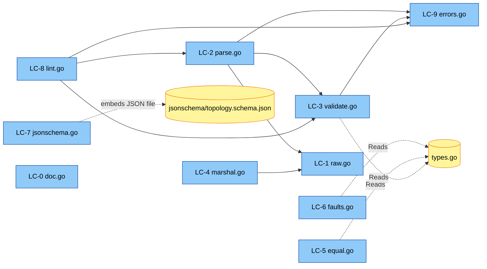

# U1 topology — Logical Components

本書は `topology/` パッケージ内の **論理コンポーネント (LC)** とそれぞれの責務・公開 API・実装スケッチを確定する。FD `domain-entities.md` §3 で提案した 16 production + 11 test ファイル構成 (Q12=A) をそのまま採用。

---

## 1. ファイル構成と LC マッピング

```text
topology/
├── doc.go                       [LC-0]  パッケージドキュメント (immutability + concurrency 明示)
├── enums.go                     [-]     U7 scaffold (変更なし)
├── types.go                     [-]     U7 scaffold (変更なし)
├── raw.go                       [LC-1]  rawSchema 等の内部型 (Parse / Marshal 共用)
├── parse.go                     [LC-2]  Parse / ParseFile / decodeRaw / buildSchema / resolveReferences
├── validate.go                  [LC-3]  Validate + validateXxx 群 (R-STR + D-*)
├── marshal.go                   [LC-4]  (*Schema).MarshalYAML
├── equal.go                     [LC-5]  Equal + equalXxx ヘルパー
├── faults.go                    [LC-6]  (*Schema).ApplyFaults + FaultOverlay lookup
├── jsonschema.go                [LC-7]  (*Schema).ExportJSONSchema + go:embed
├── jsonschema/
│   └── topology.schema.json     [-]     hand-written JSON Schema Draft 2020-12 テンプレート
├── lint.go                      [LC-8]  Lint + LintIssue / LintSeverity
├── errors.go                    [LC-9]  *ParseError + *ValidationError
└── (U7 が書いた stubs.go は削除)
```

テスト:

```text
topology/
├── doc_test.go                  [LC-T0]  Example functions (ExampleParse / ExampleSchema_MarshalYAML / ExampleLint)
├── parse_test.go                [LC-T1]  example-based for Parse
├── parse_roundtrip_test.go      [LC-T2]  TP-U1-1 (PBT: Equal(Parse(Marshal(s)), s))
├── parse_pointers_test.go       [LC-T3]  TP-U1-2 (PBT: 全ポインタ non-nil)
├── parse_consistency_test.go    [LC-T4]  TP-U1-3 (PBT: map-key / Name 整合)
├── validate_dag_test.go         [LC-T5]  TP-U1-4 (PBT: DAG)
├── validate_idempotent_test.go  [LC-T6]  TP-U1-6 (PBT: Validate idempotent)
├── validate_test.go             [LC-T7]  example-based for Validate (R-STR + D-*)
├── applyfaults_test.go          [LC-T8]  TP-U1-5 + TP-U1-7
├── jsonschema_roundtrip_test.go [LC-T9]  TP-U1-8 (jsonschema/v5 で round-trip 検証)
├── marshal_test.go              [LC-T10] example-based for MarshalYAML (順序確認)
├── equal_test.go                [LC-T11] example-based for Equal (反射律/対称律/推移律 + 順序)
└── bench_test.go                [LC-T12] BenchmarkParse (typical YAML 1 種類)
```

加えて `testdata/typical.yaml` (bench fixture) を配置。

---

## 2. 各 LC の詳細

### [LC-0] doc.go — パッケージドキュメント

#### 責務
- パッケージ概要 (3-4 段落)
- Immutability / Concurrency 保証の明示 (P-IMM-1)
- 主要 API の overview

#### 内容スケッチ
```go
// Package topology provides the schema, parser, validator, and serializer
// for declarative microservice topologies consumed by xk6-otel-gen.
//
// A topology YAML declares services (with their operations and outgoing
// calls), journeys (named user-action sequences entering operations),
// and faults (failure-injection specs targeting nodes/operations/edges).
// Parse reads YAML and returns *Schema with all cross-references resolved
// to *Service / *Operation / *Edge pointers, ready for the Journey Engine.
//
// IMMUTABILITY: *Schema and all the types it contains are designed to be
// immutable after Parse returns successfully. Mutating any field — including
// writing to Schema.Services or Service.Operations maps, appending to
// slices, or changing field values — yields undefined behavior, especially
// under concurrent access. Treat *Schema as read-only.
//
// CONCURRENCY: A read-only *Schema is safe to share across goroutines.
// Multiple journey engines (e.g., per-VU in k6) may read the same Schema
// instance concurrently without locking. The package holds no global
// mutable state and is fully reentrant.
//
// ERROR REPORTING: Parse returns a multi-error (via errors.Join) for
// reference-resolution and validation failures. Use errors.As with
// *ParseError or *ValidationError to inspect individual issues.
package topology
```

### [LC-1] raw.go — Parse / Marshal 内部型

#### 責務
- YAML との encode/decode 対応構造体 (`rawSchema`, `rawService`, `rawOperation`, `rawCallNode`, `rawCallTarget`, `rawJourney`, `rawStep`, `rawFault`, `rawRecoveryPolicy`, `rawLatencyDist`, `rawSeverity`)
- yaml タグでフィールド名対応
- ポインタ型 (`*int`, `*float64`, `*time.Duration`) で「YAML に存在しない」を表現 (デフォルト適用判定用)

#### 公開度
- すべて **unexported** (`raw*` プレフィックス)
- 外部 import から見えない

#### スケッチ
```go
type rawSchema struct {
    Services map[string]*rawService `yaml:"services"`
    Journeys map[string]*rawJourney `yaml:"journeys"`
    Faults   []*rawFault            `yaml:"faults,omitempty"`
}

type rawService struct {
    Kind       string            `yaml:"kind"`
    Replicas   *int              `yaml:"replicas,omitempty"`
    Language   string            `yaml:"language,omitempty"`
    Framework  string            `yaml:"framework,omitempty"`
    Version    string            `yaml:"version,omitempty"`
    Operations []*rawOperation   `yaml:"operations"`
}

type rawOperation struct {
    Name  string         `yaml:"name"`
    Calls []*rawCallNode `yaml:"calls,omitempty"`
}

type rawCallNode struct {
    // variant: 単一 to or parallel
    To           *rawCallTarget    `yaml:"to,omitempty"`
    Parallel     []*rawCallNode    `yaml:"parallel,omitempty"`
    // 単一 to の場合の属性
    Protocol     string            `yaml:"protocol,omitempty"`
    Operation    string            `yaml:"operation,omitempty"`  // 操作名 (callee 側ではなく自身のラベル付け、未使用ならスキップ)
    Latency      *rawLatencyDist   `yaml:"latency,omitempty"`
    ErrorRate    *float64          `yaml:"error_rate,omitempty"`
    Timeout      *time.Duration    `yaml:"timeout,omitempty"`
    Retries      *int              `yaml:"retries,omitempty"`
    RetryBackoff string            `yaml:"retry_backoff,omitempty"`
    OnFailure    *rawRecoveryPolicy `yaml:"on_failure,omitempty"`
}

type rawCallTarget struct {
    Service   string `yaml:"service"`
    Operation string `yaml:"operation"`
}

type rawJourney struct {
    Steps  []*rawStep `yaml:"steps"`
    Weight *float64   `yaml:"weight,omitempty"`
}

type rawStep struct {
    Service   string     `yaml:"service,omitempty"`
    Operation string     `yaml:"operation,omitempty"`
    Parallel  []*rawStep `yaml:"parallel,omitempty"`
}

type rawFault struct {
    Target   string         `yaml:"target"`   // "node:<svc>" / "operation:<svc>.<op>" / "edge:<svc>.<op>-><svc>.<op>"
    Kind     string         `yaml:"kind"`
    Severity *rawSeverity   `yaml:"severity"`
}

type rawSeverity struct {
    Probability *float64       `yaml:"probability,omitempty"`
    Multiplier  *float64       `yaml:"multiplier,omitempty"`
    Add         *time.Duration `yaml:"add,omitempty"`
    Value       *float64       `yaml:"value,omitempty"`
}

type rawRecoveryPolicy struct {
    Fallback        []*rawCallNode `yaml:"fallback,omitempty"`
    OnExhausted     string         `yaml:"on_exhausted,omitempty"`
    DefaultResponse map[string]any `yaml:"default_response,omitempty"`
}

type rawLatencyDist struct {
    Distribution string         `yaml:"distribution,omitempty"`
    P50          time.Duration  `yaml:"p50,omitempty"`
    P95          time.Duration  `yaml:"p95,omitempty"`
}
```

### [LC-2] parse.go — Parse / ParseFile / build / resolve

#### 責務
- `Parse(io.Reader)` の top-level エントリ
- `ParseFile(path)` の wrapper
- `decodeRaw(r, strict)` — P-PERF-1 で説明した共通 YAML decoder
- `buildSchema(raw)` — Phase 2a (型構築 + デフォルト適用)
- `resolveReferences(schema, raw)` — Phase 2b (参照解決、errors.Join)
- `resolveCallNode` / `resolveStep` / `resolveFaultTarget` の再帰ヘルパー

#### 公開 API
```go
func Parse(r io.Reader) (*Schema, error)
func ParseFile(path string) (*Schema, error)
```

#### 内部関数
```go
func decodeRaw(r io.Reader, strict bool) (*rawSchema, error)
func buildSchema(raw *rawSchema) *Schema
func resolveReferences(schema *Schema, raw *rawSchema) error

func resolveCallNode(schema *Schema, owningSvc *Service, owningOp *Operation, rc *rawCallNode, path string) (*CallNode, error)
func resolveStep(schema *Schema, rs *rawStep, path string) (*Step, error)
func resolveFaultTarget(schema *Schema, spec string, path string) (FaultTarget, error)
func resolveRecoveryPolicy(schema *Schema, owningOp *Operation, rp *rawRecoveryPolicy, path string) (*RecoveryPolicy, error)

func lookupOperation(schema *Schema, svcName, opName string) (*Operation, error)
func parseServiceKind(s string) ServiceKind
func parseProtocol(s string) Protocol
func parseBackoff(s string) BackoffPolicy
func parseFaultKind(s string) FaultKind
func resolveLatency(rl *rawLatencyDist) LatencyDist

func intDefault(p *int, def int) int
func float64Default(p *float64, def float64) float64
func durationDefault(p *time.Duration, def time.Duration) time.Duration
```

### [LC-3] validate.go — Validate + 22 個の検証

#### 責務
- `Validate(s *Schema)` の top-level
- R-STR-1〜8 の 8 検証関数
- D-1〜14 をまとめた 1 検証関数 (`validateDomainRanges`)

#### 公開 API
```go
func Validate(s *Schema) error
```

#### 内部関数
```go
func validateMapKeyConsistency(s *Schema) []error    // R-STR-1
func validateBackPointers(s *Schema) []error         // R-STR-2
func validateNoOrphanReferences(s *Schema) []error   // R-STR-3
func validateDAG(s *Schema) []error                  // R-STR-4 (P-VAL-DAG, Kahn's)
func validateJourneyReachability(s *Schema) []error  // R-STR-5
func validateFaultTargets(s *Schema) []error         // R-STR-6
func validateCallNodeVariants(s *Schema) []error     // R-STR-7
func validateRecoveryPolicyOwnership(s *Schema) []error // R-STR-8
func validateDomainRanges(s *Schema) []error         // D-1..D-14

// helpers for traversal
func forEachOutgoingEdge(s *Schema, fn func(*Edge))
func forEachEdgeInCalls(calls []*CallNode, fn func(*Edge))
func outgoingTargets(op *Operation) []*Operation
func identifyOp(op *Operation) string  // "<svc>.<op>"
```

### [LC-4] marshal.go — MarshalYAML

#### 責務
- `(*Schema).MarshalYAML()` 実装 (P-MARSHAL-1)
- 並び順 helper (`sortedServiceIDs`, `sortedKeys`)
- 各型を `*raw*` に変換するヘルパー

#### 公開 API
```go
func (s *Schema) MarshalYAML() (any, error)
```

#### 内部関数
```go
func sortedServiceIDs(m map[ServiceID]*Service) []ServiceID
func sortedKeys[V any](m map[string]V) []string

func marshalService(svc *Service) *rawService
func marshalOperations(ops map[string]*Operation) []*rawOperation
func marshalCallNodes(nodes []*CallNode) []*rawCallNode
func marshalCallNode(n *CallNode) *rawCallNode
func marshalEdge(e *Edge) *rawCallNode
func marshalRecoveryPolicy(rp *RecoveryPolicy) *rawRecoveryPolicy
func marshalJourney(j *Journey) *rawJourney
func marshalStep(s *Step) *rawStep
func marshalFault(f FaultSpec) *rawFault
func marshalFaultTarget(t FaultTarget) string  // "node:<svc>" 等

// pointer helpers
func ptrInt(v int) *int            { return &v }
func ptrFloat64(v float64) *float64 { return &v }
func ptrDuration(v time.Duration) *time.Duration { return &v }
```

### [LC-5] equal.go — Equal

#### 責務
- `Equal(a, b *Schema)` 実装 (P 識別子ベース、FD `business-rules.md` §4)
- 各サブ構造の equalXxx ヘルパー

#### 公開 API
```go
func Equal(a, b *Schema) bool
```

#### 内部関数
```go
func equalServices(a, b map[ServiceID]*Service) bool
func equalService(a, b *Service) bool
func equalOperations(a, b map[string]*Operation) bool
func equalOperation(a, b *Operation) bool
func equalCalls(a, b []*CallNode) bool
func equalCallNode(a, b *CallNode) bool
func equalEdge(a, b *Edge) bool
func equalRecoveryPolicy(a, b *RecoveryPolicy) bool
func equalJourneys(a, b map[string]*Journey) bool
func equalJourney(a, b *Journey) bool
func equalSteps(a, b []*Step) bool
func equalStep(a, b *Step) bool
func equalFaults(a, b []FaultSpec) bool
func equalFaultSpec(a, b FaultSpec) bool
func equalFaultTarget(a, b FaultTarget) bool
func equalLatency(a, b LatencyDist) bool
func equalSeverity(a, b SeverityParams) bool

// identityOp は equal.go と validate.go で共有
// (identifyOp が validate.go 内に既にあるので equal.go ではそれを使う)
```

### [LC-6] faults.go — ApplyFaults + Overlay lookup

#### 責務
- `(*Schema).ApplyFaults()` 実装 (P-PERF などの最適化は限定的、シンプル実装)
- `FaultOverlay.NodeFaults / OperationFaults / EdgeFaults` の lookup

#### 公開 API
```go
func (s *Schema) ApplyFaults() *FaultOverlay
func (o *FaultOverlay) NodeFaults(svc *Service) []FaultSpec
func (o *FaultOverlay) OperationFaults(op *Operation) []FaultSpec
func (o *FaultOverlay) EdgeFaults(e *Edge) []FaultSpec

// equality helper for TP-U1-7 (and external users wishing to compare overlays)
func FaultOverlayEqual(a, b *FaultOverlay) bool
```

### [LC-7] jsonschema.go — ExportJSONSchema + go:embed

#### 責務
- `topology/jsonschema/topology.schema.json` を embed
- `(*Schema).ExportJSONSchema()` で copy を返す

#### 公開 API
```go
func (s *Schema) ExportJSONSchema() ([]byte, error)
```

#### スケッチ
```go
import _ "embed"

//go:embed jsonschema/topology.schema.json
var jsonSchemaTemplate []byte

func (s *Schema) ExportJSONSchema() ([]byte, error) {
    out := make([]byte, len(jsonSchemaTemplate))
    copy(out, jsonSchemaTemplate)
    return out, nil
}
```

### [LC-8] lint.go — Lint + LintIssue

#### 責務
- `Lint(io.Reader) ([]LintIssue, error)` 実装
- `LintIssue` / `LintSeverity` 型
- `decodeRaw(r, strict=true)` を呼び unknown-field を取得 (yaml.v3 が strict mode で詳細エラーを返すか確認次第)
- `Validate` を再利用しつつ、結果を `[]LintIssue` に変換

#### 公開 API
```go
func Lint(r io.Reader) ([]LintIssue, error)

type LintIssue struct {
    Path     string
    Severity LintSeverity
    Message  string
}

type LintSeverity int
const (
    LintError LintSeverity = iota
    LintWarning
)

func (s LintSeverity) String() string
```

### [LC-9] errors.go — ParseError / ValidationError

#### 責務
- `*ParseError` / `*ValidationError` 型
- `Error()`, `Unwrap()` メソッド
- ヘルパー: `newParseError(path, msg string)`, `newValidationError(path, rule, msg string)`

#### 公開 API
```go
type ParseError struct {
    Path    string
    Message string
    Inner   error
}
func (e *ParseError) Error() string
func (e *ParseError) Unwrap() error

type ValidationError struct {
    Path    string
    Rule    string
    Message string
}
func (e *ValidationError) Error() string
```

---

## 3. テスト LC

### [LC-T0] doc_test.go — Example functions

3 件のみ (P-DOC-1):
- `ExampleParse` — minimal YAML を Parse
- `ExampleSchema_MarshalYAML` — round-trip
- `ExampleLint` — Lint 結果の表示

### [LC-T1〜T11] 各機能のテスト

| LC | テスト関数 | カテゴリ |
|---|---|---|
| LC-T1 (parse_test.go) | `TestParse_MinimalSchema`, `TestParse_DefaultsApplied`, `TestParse_YAMLSyntaxError_FailFast`, ... | example-based |
| LC-T2 (parse_roundtrip_test.go) | `TestParse_RoundTrip` | PBT (TP-U1-1) |
| LC-T3 (parse_pointers_test.go) | `TestParse_NoNilPointers` | PBT (TP-U1-2) |
| LC-T4 (parse_consistency_test.go) | `TestParse_MapKeyConsistency` | PBT (TP-U1-3) |
| LC-T5 (validate_dag_test.go) | `TestValidate_AlwaysDAG` + 個別 cycle 検出 | PBT (TP-U1-4) + example |
| LC-T6 (validate_idempotent_test.go) | `TestValidate_Idempotent` | PBT (TP-U1-6) |
| LC-T7 (validate_test.go) | `TestValidate_StructuralRules`, `TestValidate_DomainRanges` | example-based |
| LC-T8 (applyfaults_test.go) | `TestApplyFaults_OverlayCovers`, `TestApplyFaults_Idempotent` | PBT (TP-U1-5, TP-U1-7) |
| LC-T9 (jsonschema_roundtrip_test.go) | `TestExportJSONSchema_RoundTrip` | PBT (TP-U1-8) |
| LC-T10 (marshal_test.go) | `TestMarshal_AlphabeticalOrder`, `TestMarshal_PreservesSequenceOrder` | example-based |
| LC-T11 (equal_test.go) | `TestEqual_Reflexive`, `TestEqual_Symmetric`, `TestEqual_Transitive`, `TestEqual_OrderSensitive` | example-based |

### [LC-T12] bench_test.go

```go
//go:embed testdata/typical.yaml
var typicalYAML []byte

func BenchmarkParse(b *testing.B) {
    b.ReportAllocs()
    b.ResetTimer()
    for i := 0; i < b.N; i++ {
        if _, err := Parse(bytes.NewReader(typicalYAML)); err != nil {
            b.Fatal(err)
        }
    }
}
```

`testdata/typical.yaml` は手書きで、10 services / 30 operations / 50 edges を含む。

---

## 4. カバレッジ戦略 (NFR-U1-8: 80%)

| ファイル | 想定 LOC (production) | カバレッジ寄与 |
|---|---|---|
| doc.go | 5 | 100% (no code) |
| raw.go | 60 | 100% (only struct defs) |
| parse.go | 200 | 85%+ (Phase 2a/2b 全パス、エラーパスは LC-T1 で網羅) |
| validate.go | 250 | 80%+ (各 validateXxx を example で個別) |
| marshal.go | 150 | 90%+ (各 marshal helper を example で) |
| equal.go | 120 | 80%+ (順序ケース + 順不同ケース) |
| faults.go | 60 | 90%+ (3 種類のターゲット) |
| jsonschema.go | 20 | 100% (シンプル embed) |
| lint.go | 80 | 80%+ |
| errors.go | 30 | 100% |
| **合計** | **~975** | **~83-85%** |

カバレッジ低下リスク: `validate.go` のドメインエラーケース (D-1..D-14) を各々テストするのは手間。最初に R-STR + 主要 D だけテストし、後で補強。

---

## 5. 依存図 (LC 間)



サイクルなし。errors.go が leaf、raw.go が parse + marshal の中間ハブ。

---

## 6. 実装フェーズ (U1 Code Generation Phase 計画の predictor)

U1 Code Generation Planning ステージで以下のフェーズに分解される予定:

| Phase | LC | 説明 |
|---|---|---|
| Phase 0 | (go.mod 1.25 bump + stubs.go 削除 + dep 追加) | 環境準備 |
| Phase 1 | LC-9 (errors.go) | エラー型を最初に作る (他から参照されるため) |
| Phase 2 | LC-1 (raw.go) | 内部型 |
| Phase 3 | LC-2 (parse.go) — Parse / decodeRaw / buildSchema / resolveReferences | コア機能 |
| Phase 4 | LC-3 (validate.go) | 検証 |
| Phase 5 | LC-4 (marshal.go) | Marshal (Parse の round-trip テストに必要) |
| Phase 6 | LC-5 (equal.go) | Equal (TP-U1-1 で必要) |
| Phase 7 | LC-6 (faults.go) | ApplyFaults |
| Phase 8 | LC-7 (jsonschema.go) + JSON Schema template file | Schema export |
| Phase 9 | LC-8 (lint.go) | Lint |
| Phase 10 | LC-T0..T12 全テスト | テスト |
| Phase 11 | LC-0 (doc.go) 完成 + LC-T0 example | ドキュメント |
| Phase 12 | DoD 検証 + summary | 完了 |
| Phase 13 | U7 への追加 generator 18 件 (testutil/generators/) | U7 拡張 |

各 phase で conventional commit を作る (`feat(u1-topology): ...`, `test(u1-topology): ...` 等)。Code Generation Planning で確定。

---

## 7. NFR-D パターンと LC の対応表

| LC | 適用パターン |
|---|---|
| LC-0 doc.go | P-IMM-1, P-DOC-2 |
| LC-1 raw.go | P-PERF-2 (struct tag), Q3 default 用 ポインタ field |
| LC-2 parse.go | P-PERF-1, P-PERF-2, P-PERF-4, P-ERR-2, P-ERR-3, Q6 |
| LC-3 validate.go | P-VAL-DAG (Kahn), Q5 (順序固定) |
| LC-4 marshal.go | P-MARSHAL-1, P-MARSHAL-2 (Q4 アルファベット昇順) |
| LC-5 equal.go | (FD `business-rules.md` §4 の規則実装) |
| LC-6 faults.go | (FD §6 の overlay 構造実装) |
| LC-7 jsonschema.go | P-JSON-1, P-JSON-2 |
| LC-8 lint.go | P-PERF-1 (decodeRaw 共通化) |
| LC-9 errors.go | P-ERR-1 |
| LC-T2..T9 | P-TEST-3 (t.Parallel()), PBT-08 (rapid 既定 shrink) |
| LC-T12 | P-PERF-3 (BenchmarkParse) |
