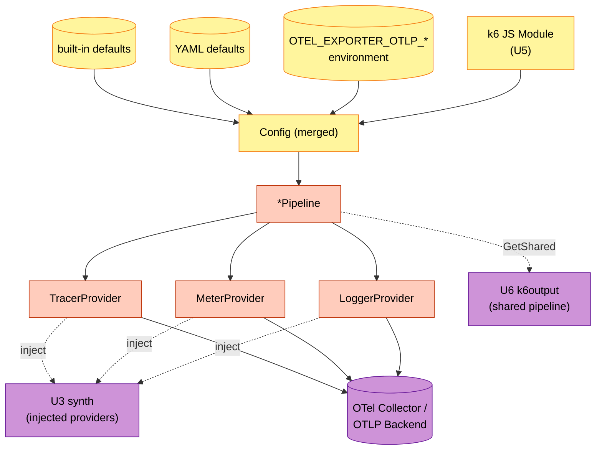

# U4 exporter — Business Logic Model

本書は `exporter/` パッケージのメソッド業務ロジック (Config merge / Provider 構築 / Shared Pipeline holder / Stats / Shutdown) を確定する。OTel Go SDK の薄いラッパーであるため、ロジックの大半は「Config を OTel SDK 呼び出しに翻訳する」処理。

---

## 1. Config 設計 (Q1=A 単一 Config)

すべての設定を 1 つの `Config` 構造体に統合。3 信号 (Traces / Metrics / Logs) で同じ Endpoint / Headers / Protocol を共用する典型シナリオに最適。

### Config 構造

```go
type Config struct {
    Protocol          Protocol           // ProtocolGRPC | ProtocolHTTP
    Endpoint          string             // e.g., "https://otel.example.com:4317"
    Headers           map[string]string
    Insecure          bool               // skip TLS verification
    Compression       string             // "gzip" | "" (none)
    Timeout           time.Duration      // per-request timeout (default 10s)
    BatchSize         int                // BatchProcessor.MaxExportBatchSize
    BatchTimeout      time.Duration      // BatchProcessor.BatchTimeout
    MaxQueueSize      int                // BatchProcessor.MaxQueueSize
    ResourceOverrides map[string]string  // override SDK-detected resource attrs
}
```

Protocol は enum:
```go
type Protocol int
const (
    ProtocolGRPC Protocol = iota
    ProtocolHTTP
)
```

### 4 段階 merge (`MergeWith`)

優先順位: **JS API > 環境変数 > YAML defaults > built-in defaults**。merge は段階的に行い、上位の値が下位を上書き:

```go
// Config.MergeWith returns a new Config where override fields take precedence
// over c's fields. Zero values in override do NOT override (this is how merge
// "absence" is signaled — to clear a value, pass an explicit zero-equivalent
// sentinel like Headers=map[string]string{}).
func (c Config) MergeWith(override Config) Config
```

Merge ルール:
| Field | 上書き条件 |
|---|---|
| `Protocol` | override.Protocol が `ProtocolGRPC` (= zero) でない場合のみ |
| `Endpoint` | override.Endpoint が `""` でない場合のみ |
| `Headers` | override.Headers が `nil` でない場合、map ごと置換 (個別 key の merge ではなく置換、シンプル化) |
| `Insecure` | override.Insecure が true の場合のみ (false は明示的 override にならない、片方向ブール) |
| `Compression` | override.Compression が `""` でない場合のみ |
| `Timeout` | override.Timeout が 0 でない場合のみ |
| `BatchSize`/`BatchTimeout`/`MaxQueueSize` | 0 でない場合のみ |
| `ResourceOverrides` | override.ResourceOverrides が nil でない場合、map ごと置換 |

> 注: `Insecure=false` を強制したい場合は、Config を直接構築するか、`Insecure=true` を上位で `false` で上書きできない設計。これは「security-defaults-secure」の便利 default を維持しつつ、explicit な insecure 設定を許す形。利用者が明示的に `Insecure=false` を設定したい場合は、merge 後に手動で書き換える (テスト用途想定)。

### 典型的な利用パス

```go
builtIn := Config{Protocol: ProtocolGRPC, Timeout: 10 * time.Second, ...}
yamlDefaults := /* ...read from topology YAML defaults section, if present... */
envCfg := ConfigFromEnv()         // Q2=A、後述
jsCfg := /* ...passed from JS configure(opts)... */

final := builtIn.MergeWith(yamlDefaults).MergeWith(envCfg).MergeWith(jsCfg)
pipeline, err := exporter.New(final)
```

---

## 2. `ConfigFromEnv` (Q2=A 標準 env 全部尊重)

OTel SDK の標準環境変数を尊重し、Config に反映:

```go
// ConfigFromEnv reads OTEL_EXPORTER_OTLP_* environment variables and returns
// a Config populated from them. Unset variables leave the corresponding
// Config field at its zero value (so subsequent MergeWith semantics work).
func ConfigFromEnv() Config
```

### サポートする env

汎用 (全信号共通):
- `OTEL_EXPORTER_OTLP_ENDPOINT` → `Config.Endpoint`
- `OTEL_EXPORTER_OTLP_HEADERS` → `Config.Headers` (CSV `key1=val1,key2=val2`)
- `OTEL_EXPORTER_OTLP_PROTOCOL` → `Config.Protocol` (`grpc` → `ProtocolGRPC`、`http/protobuf` → `ProtocolHTTP`)
- `OTEL_EXPORTER_OTLP_COMPRESSION` → `Config.Compression`
- `OTEL_EXPORTER_OTLP_TIMEOUT` → `Config.Timeout` (ms 単位、OTel SDK 標準)
- `OTEL_EXPORTER_OTLP_INSECURE` → `Config.Insecure`

信号別 (汎用より優先):
- `OTEL_EXPORTER_OTLP_TRACES_ENDPOINT`, `OTEL_EXPORTER_OTLP_METRICS_ENDPOINT`, `OTEL_EXPORTER_OTLP_LOGS_ENDPOINT`
- 同じく `_HEADERS`, `_PROTOCOL`, `_COMPRESSION`, `_TIMEOUT`, `_INSECURE` の signal-specific prefix

ただし Q1=A により本 unit は **単一 Config** モデル。**信号別 env が指定された場合**は:
- 同じ値が 3 信号すべてに設定されている場合 → そのまま採用 (3 信号で異なる endpoint 指定は本 unit では非サポート — 警告ログ相当の `LintIssue` 等は将来検討)
- 異なる値の場合 → **エラー** (`ConfigFromEnv` から `*ConfigError` を返す)

実装方針: ConfigFromEnv は signal-specific を読み、3 信号で一致したらその値、不一致なら error。簡素化が必要なら **汎用 env のみ尊重し、signal-specific env を読まない** という選択肢もあるが、Q2=A は「標準 env 全部尊重」を選んだので一致チェック方式を採用。

### Headers の CSV パース

`OTEL_EXPORTER_OTLP_HEADERS=Authorization=Bearer%20abc,X-Tenant=foo` → `map[string]string{"Authorization": "Bearer abc", "X-Tenant": "foo"}`. value は URL-decoded (OTel SDK 仕様)。

---

## 3. Pipeline 構築 (`New(Config)`)

3 信号の Exporter / BatchProcessor / Provider を構築し、`*Pipeline` を返す。

### 全体フロー

```go
func New(cfg Config) (*Pipeline, error) {
    // 1. Config をデフォルトで埋める (zero value のフィールドに built-in default を適用)
    cfg = fillDefaults(cfg)

    // 2. Resource を構築 (Q10=A: SDK detector → override で上書き)
    res, err := buildResource(cfg)
    if err != nil {
        return nil, &PipelineError{Stage: "resource", Inner: err}
    }

    // 3. 3 信号の Exporter を並列に作る (Q5=A: all-or-nothing)
    traceExp, err := buildTraceExporter(cfg)
    if err != nil {
        return nil, &PipelineError{Stage: "trace_exporter", Inner: err}
    }
    metricExp, err := buildMetricExporter(cfg)
    if err != nil {
        _ = traceExp.Shutdown(context.Background())
        return nil, &PipelineError{Stage: "metric_exporter", Inner: err}
    }
    logExp, err := buildLogExporter(cfg)
    if err != nil {
        _ = traceExp.Shutdown(context.Background())
        _ = metricExp.Shutdown(context.Background())
        return nil, &PipelineError{Stage: "log_exporter", Inner: err}
    }

    // 4. Provider を構築 (BatchProcessor / PeriodicReader を内包)
    tp := sdktrace.NewTracerProvider(
        sdktrace.WithResource(res),
        sdktrace.WithBatcher(traceExp, sdktrace.WithMaxExportBatchSize(cfg.BatchSize), ...),
    )
    mp := sdkmetric.NewMeterProvider(
        sdkmetric.WithResource(res),
        sdkmetric.WithReader(sdkmetric.NewPeriodicReader(metricExp, sdkmetric.WithInterval(cfg.BatchTimeout))),
    )
    lp := sdklog.NewLoggerProvider(
        sdklog.WithResource(res),
        sdklog.WithProcessor(sdklog.NewBatchProcessor(logExp, ...)),
    )

    return &Pipeline{
        cfg:           cfg,
        traceProvider: tp,
        meterProvider: mp,
        loggerProvider: lp,
        stats:         newStats(),
    }, nil
}
```

### Exporter 構築 (Protocol 別)

```go
func buildTraceExporter(cfg Config) (sdktrace.SpanExporter, error) {
    switch cfg.Protocol {
    case ProtocolGRPC:
        opts := []otlptracegrpc.Option{
            otlptracegrpc.WithEndpoint(cfg.Endpoint),
            otlptracegrpc.WithHeaders(cfg.Headers),
            otlptracegrpc.WithTimeout(cfg.Timeout),
        }
        if cfg.Insecure { opts = append(opts, otlptracegrpc.WithInsecure()) }
        if cfg.Compression == "gzip" { opts = append(opts, otlptracegrpc.WithCompressor("gzip")) }
        return otlptracegrpc.New(context.Background(), opts...)
    case ProtocolHTTP:
        opts := []otlptracehttp.Option{
            otlptracehttp.WithEndpoint(cfg.Endpoint),
            otlptracehttp.WithHeaders(cfg.Headers),
            otlptracehttp.WithTimeout(cfg.Timeout),
        }
        if cfg.Insecure { opts = append(opts, otlptracehttp.WithInsecure()) }
        if cfg.Compression == "gzip" { opts = append(opts, otlptracehttp.WithCompression(otlptracehttp.GzipCompression)) }
        return otlptracehttp.New(context.Background(), opts...)
    }
    return nil, fmt.Errorf("unknown protocol: %v", cfg.Protocol)
}
// metric / log も同様
```

### `fillDefaults`

```go
func fillDefaults(cfg Config) Config {
    if cfg.Endpoint == "" { cfg.Endpoint = "localhost:4317" } // OTel SDK 既定
    if cfg.Timeout == 0 { cfg.Timeout = 10 * time.Second }
    if cfg.BatchSize == 0 { cfg.BatchSize = 512 }
    if cfg.BatchTimeout == 0 { cfg.BatchTimeout = 5 * time.Second }
    if cfg.MaxQueueSize == 0 { cfg.MaxQueueSize = 2048 }
    return cfg
}
```

(Q4=A: OTel SDK デフォルト値をそのまま採用)

### Resource 構築 (Q10=A)

```go
func buildResource(cfg Config) (*sdkresource.Resource, error) {
    base, err := sdkresource.New(context.Background(),
        sdkresource.WithFromEnv(),
        sdkresource.WithHost(),
        sdkresource.WithProcess(),
        sdkresource.WithOS(),
    )
    if err != nil {
        return nil, err
    }
    if len(cfg.ResourceOverrides) == 0 {
        return base, nil
    }
    overrideAttrs := make([]attribute.KeyValue, 0, len(cfg.ResourceOverrides))
    for k, v := range cfg.ResourceOverrides {
        overrideAttrs = append(overrideAttrs, attribute.String(k, v))
    }
    return sdkresource.Merge(base, sdkresource.NewSchemaless(overrideAttrs...))
}
```

`Merge` の semantics は OTel SDK 標準: 第二引数が同名 key を持つ場合は上書き、なければ第一引数を保持。

---

## 4. Shared Pipeline Holder (Q3=A)

```go
// shared.go
var (
    sharedOnce     sync.Once
    sharedPipeline *Pipeline
    sharedErr      error
)

// GetShared returns the process-wide shared Pipeline, initializing it
// via the supplied factory on first call. Subsequent calls return the
// same instance (or error). The factory is invoked at most once.
func GetShared(factory func() (*Pipeline, error)) (*Pipeline, error) {
    sharedOnce.Do(func() {
        sharedPipeline, sharedErr = factory()
    })
    return sharedPipeline, sharedErr
}

// SetShared overrides the shared pipeline. Intended for tests; calling
// it from production code is a smell. Returns an error if a shared
// pipeline is already in use and SetShared was not preceded by
// ResetShared. (Tests should call ResetShared first.)
func SetShared(p *Pipeline) error

// ResetShared zeroes out the shared-pipeline state. Test-only utility.
// Calling from production code is a bug; lint can flag callsites.
func ResetShared()
```

### Q9=A 多重 New idempotency

`GetShared` の挙動:
- 初回成功時: `*Pipeline` をキャッシュし返却
- 初回失敗時: `sharedErr` をキャッシュし、以降毎回 error を返す (再試行しない、k6 ライフサイクル全体を fail fast)
- 2 回目以降の成功時: 初回と同じインスタンスを返却

`SetShared` 失敗時の挙動:
- 既に shared が non-nil の場合エラー (テストで明示的に ResetShared する規約)

### 多重 Shutdown idempotency

`(*Pipeline).Shutdown(ctx)` は内部に `sync.Once` を持ち、初回呼び出しのみ実 shutdown を実行し結果をキャッシュ。2 回目以降は同じ error (or nil) を返す。

---

## 5. Stats (Q6=A 最小、Q7=A per-field atomic)

```go
type Stats struct {
    TracesExported  int64
    TracesFailed    int64
    MetricsExported int64
    MetricsFailed   int64
    LogsExported    int64
    LogsFailed      int64
}
```

**QueueLen は含めない**。理由: OTel Go SDK の `BatchSpanProcessor` / `BatchProcessor` / `PeriodicReader` のいずれも **public な queue-length 取得 API を露出していない** ことを upstream リポジトリで確認済み (NFR Design Q3 検証)。metric の `PeriodicReader` は pull-based 設計のため queue 概念自体が N/A。将来 SDK が公開 API を追加したら本 Stats を拡張する余地はあるが、現時点では **フィールド自体を持たない** (`将来の互換性のため` という理由でゼロ値フィールドを残さない方針、利用者明示)。

### 内部実装

```go
type pipelineStats struct {
    tracesExported  atomic.Int64
    tracesFailed    atomic.Int64
    metricsExported atomic.Int64
    metricsFailed   atomic.Int64
    logsExported    atomic.Int64
    logsFailed      atomic.Int64
}

func newStats() *pipelineStats {
    return &pipelineStats{}
}

func (p *Pipeline) Stats() Stats {
    return Stats{
        TracesExported:  p.stats.tracesExported.Load(),
        TracesFailed:    p.stats.tracesFailed.Load(),
        MetricsExported: p.stats.metricsExported.Load(),
        MetricsFailed:   p.stats.metricsFailed.Load(),
        LogsExported:    p.stats.logsExported.Load(),
        LogsFailed:      p.stats.logsFailed.Load(),
    }
}
```

### カウンタ更新タイミング

- `TracesExported` / `MetricsExported` / `LogsExported`: OTel SDK の Exporter が返す success time に対応する **batch サイズ分加算**
- `TracesFailed` / `MetricsFailed` / `LogsFailed`: Exporter が error を返したら 1 加算

### 実装の詳細 (Stats 更新)

OTel SDK の Exporter interface (`ExportSpans / ExportMetrics / ExportLogs`) をラップする内部型を作り、その中で stats を更新:

```go
type tracingExporter struct {
    inner sdktrace.SpanExporter
    stats *pipelineStats
}

func (e *tracingExporter) ExportSpans(ctx context.Context, spans []sdktrace.ReadOnlySpan) error {
    err := e.inner.ExportSpans(ctx, spans)
    if err != nil {
        e.stats.tracesFailed.Add(1)
        return err
    }
    e.stats.tracesExported.Add(int64(len(spans)))
    return nil
}

func (e *tracingExporter) Shutdown(ctx context.Context) error {
    return e.inner.Shutdown(ctx)
}
```

### Stats の monotonicity (PBT-03 invariant の根拠)

- 全カウンタは **減少しない** (`atomic.Add` のみ、`Store` しない)
- `Stats()` は monotonic snapshot を返す (各 field は同一時点を保証しないが、各 field は他の field と独立に monotonic increasing)

### Future: QueueLen の追加可能性 (TODO)

- 現在の OTel Go SDK (2025-06 時点で確認) は `BatchSpanProcessor` / `BatchProcessor` のキュー長を public API として露出していない (`Len()` は unexported、`MarshalLog` は logging 用)
- `PeriodicReader` (metric) は pull-based 設計でそもそも queue 概念が存在しない
- 将来 SDK が `QueueSize()` 等を追加した場合、Traces/Logs についてのみ Stats への追加を再評価
- Metric の `QueueLen` は意味論的に対応する概念がないため、SDK の進化に関わらず追加しない

---

## 6. Shutdown (Q8=A ctx deadline)

```go
func (p *Pipeline) Shutdown(ctx context.Context) error {
    p.shutdownOnce.Do(func() {
        p.shutdownErr = errors.Join(
            p.traceProvider.Shutdown(ctx),   // OTel SDK が ctx を尊重
            p.meterProvider.Shutdown(ctx),
            p.loggerProvider.Shutdown(ctx),
        )
    })
    return p.shutdownErr
}
```

OTel SDK の各 Provider.Shutdown(ctx) は ctx deadline を尊重し、超過時は ctx.Err を返す。Pipeline.Shutdown はそれを集約。

`shutdownOnce` により多重呼び出し時の冪等性 (Q9=A)。

---

## 7. データフロー図



---

## 8. テストフレームワーク仕様 (Q11=A、コア 4 件)

Testable Properties は `business-rules.md` §6 で詳述。`exporter` パッケージの実装テストは:

- **TP-U4-1** (PBT-03 invariant): `MergeWith` の優先順位則 — `builtIn.MergeWith(env).MergeWith(js)` で js の non-zero フィールドが必ず最終値
- **TP-U4-2** (PBT-04 idempotency): `c.MergeWith(c) == c`
- **TP-U4-3** (PBT-02 round-trip): OTLP protobuf の Marshal/Unmarshal — 任意 ResourceSpans / ResourceMetrics / ResourceLogs を marshal → unmarshal で同等。OTel SDK は protobuf 型を露出しないので、本 unit では実 Exporter 経由ではなく `go.opentelemetry.io/proto/otlp` 直接利用のテスト
- **TP-U4-4** (PBT-03 monotonicity): Stats counters は単調増加

Integration test (real Collector に対する送信) は **本 FD では別件**、NFR-4.1 + Build and Test ステージで対応。
