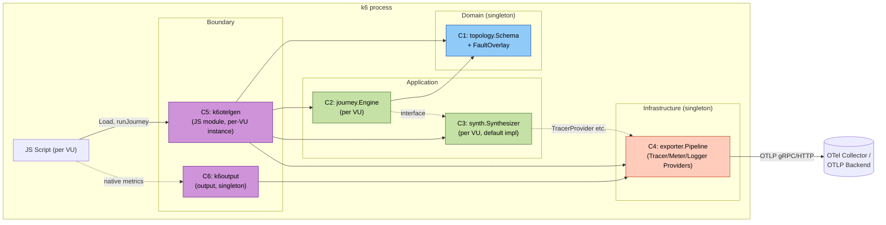

# Application Design — xk6-otel-gen (consolidated)

本ドキュメントは Application Design ステージの成果を統合したマスターサマリです。詳細は以下のサブドキュメントを参照:

- [`components.md`](./components.md) — コンポーネント定義・責務・主な型
- [`component-methods.md`](./component-methods.md) — 公開メソッドシグネチャ
- [`services.md`](./services.md) — サービスレイヤとオーケストレーションフロー
- [`component-dependency.md`](./component-dependency.md) — 依存マトリクスと通信パターン
- [`topology-yaml-schema.md`](./topology-yaml-schema.md) — トポロジー YAML の構造と完全な例 (Operation を第一級概念に)

---

## 1. 設計の前提 (Q&A 確定事項)

| 観点 | 決定 (元の Q&A) |
|---|---|
| ユニット境界 | 6 ユニットそのまま採用 (Q1=A) |
| YAML スキーマ | シンプル単一ファイル (Q2=A)。トップレベル `services:` / `journeys:` / `faults:`。**Operation を第一級概念**にし、edge は `Service.operations[].calls:` 配下に置く。完全な例とバリデーション規則は [`topology-yaml-schema.md`](./topology-yaml-schema.md) を参照。 |
| k6 Output モジュールの役割 | **デュアル機能** (Q3=C): 合成シグナル egress + k6 ネイティブメトリクス OTLP 化。**End-of-run Summary は責務外** (k6 標準の stdout/`--summary-export`/`handleSummary` を利用者が選択)。 |
| JS API 形状 | 完全宣言的 `topology.runJourney(name)` (Q4=A) |
| OTLP 実装 | OTel Go SDK フル活用 (Q5=A) |
| 時間モデル | 実時間 (`time.Sleep`) (Q6=A)。仮想時間は将来 TODO |
| 並行性 | 基本逐次 + ジャーニー定義内の `parallel:` ブロックで部分並行 (Q7=X 解釈) |
| 失敗注入 | YAML の `faults:` セクション → Topology Loading 時に overlay 化 → Journey Engine が参照。**カスケードは条件付き**: エッジに `on_failure` が定義されリカバリーが成功すれば伝播しない (cache-aside 等の現実的な障害許容パターンを表現可能)。`on_exhausted` で `propagate`/`return_default`/`succeed_silently` を選択。 (Q8=A 解釈の改訂版) |
| 設定優先順位 | JS configure > env > YAML defaults > 内蔵デフォルト (Q9=A) |
| 配布 | プリビルドバイナリ + README にセキュリティ警告 (Q10=B) |
| モジュールパス | `github.com/ymotongpoo/xk6-otel-gen` (Q11=A) |

---

## 2. アーキテクチャ概観

### 2.1 Clean Architecture 4 + 1 レイヤ

```
+--------------------------------------------------+
| Boundary    : k6otelgen (C5) + k6output (C6)
+--------------------------------------------------+
| Application : journey (C2) + synth (C3)
+--------------------------------------------------+
| Domain      : topology (C1)
+--------------------------------------------------+
| Infrastructure: exporter (C4)
+--------------------------------------------------+
| Frameworks  : otel-sdk, k6-sdk, yaml.v3
+--------------------------------------------------+
```

### 2.2 主要なデータフロー

```
[k6 JS]  → topology.runJourney("checkout")
          → C5 (JS Module) → C2 (Journey Engine, per-VU)
            → for each Node in Plan:
              - C1 FaultOverlay 参照 → Outcome 決定
              - C3 (Synthesizer) で span/metric/log を Provider 経由で SDK へ
              - `time.Sleep(latency)` で実時間消費
              - parallel ブロックは sync.WaitGroup で goroutine 並列
          → C4 (Pipeline) の BatchProcessor が非同期で OTLP 送信

[k6 native metrics] → C6 (Output) → 同じ C4 Pipeline → OTLP/Metrics として送信
                       (service.name="xk6-otel-gen-runner")
```

---

## 3. コンポーネント全体図



---

## 4. 要件 (FR/NFR) → コンポーネントの追跡可能性

| 要件 ID | 担当コンポーネント | 補足 |
|---|---|---|
| FR-1.1 (xk6 build) | (C5 + C6 + cmd) | Go モジュールとして提供 |
| FR-1.2 (JS + Output 両方) | **C5 + C6** | デュアル機能 (Q3=C) |
| FR-2 (YAML 入力) | **C1** | スキーマ + パーサ + バリデータ |
| FR-2.2 (サービス kind, replicas, edges, journeys, faults) | **C1** | Schema 型 |
| FR-3 (Metrics/Logs/Traces 3 信号) | **C3 + C4** | C3 が合成、C4 が egress |
| FR-4 (OTLP/gRPC + HTTP) | **C4** | 双方の OTel SDK exporter を構築 |
| FR-5 (E2E シミュレーション) | **C2** | journey 単位で trace 連鎖 |
| FR-5.3 (k6 シナリオで時間制御) | **C5** | iteration が runJourney をトリガ |
| FR-6 (Semantic Conventions) | **C3 (synth/attributes)** | Resource/HTTP/RPC/Error |
| FR-7 (失敗シナリオ E) | **C1 (FaultOverlay) + C2** | cascade ロジック含む |
| FR-8 (宣言的 JS API) | **C5** | runJourney(name) |
| FR-9 (サンプル) | examples/ + cmd/ | Build and Test で完成 |
| NFR-1 (1k RPS, 性能) | **C4 + C3** | BatchProcessor チューニング |
| NFR-2 (Reliability) | **C4** | retry + stats + fail fast (C1) |
| NFR-4 (Unit + Integration + PBT Full) | 各 C 内 `*_test.go`, `testutil/generators` | PBT-01〜10 |
| NFR-5 (拡張の自己観測) | **C4 (Stats)** + **C6 (k6 native metrics OTLP化)** | 内部メトリクス露出 |
| NFR-6 (ドキュメント) | README + JSON Schema | examples/ で実例 |

---

## 5. Functional Design / NFR Design で確定する事項

Application Design は **「何が」あるか** を決定する段階。以下は **「どう」動くか / どんなパラメータか** であり、後段で確定:

- `topology` の Marshaler 実装詳細 (`*Service`/`*Edge` ポインタを名前 string に戻す `MarshalYAML`)、および `topology.Equal` の正確な等価規則
- `JourneyID` newtype の導入可否 (`Schema.Journeys` のマップキーも newtype 化するか — 一貫性 vs ボイラープレート)
- レイテンシ分布の具体パラメータ (lognormal/normal/exponential)
- **`Edge.OnFailure` の YAML 表現形式** (インラインネスト vs 名前付き `recovery_flows:` 参照)
- **リカバリーチェーンのネスト深さ制限と fallback 内 `OnFailure` の許可可否**
- **`DefaultResponse` の属性構造と span/log への反映ルール** (`fallback.default_used=true`, `fallback.used=<edge-id>`, `fallback.attempt=N`)
- **リカバリー試行中のレイテンシ加算と timeout 伝播** (primary timeout + fallback latency = step total、ジャーニー全体 timeout の伝播)
- Resource 属性合成の `telemetry.sdk.language` デフォルト値の選択基準
- `parallel:` ブロックのバウンディング (最大同時数、ネスト可否、タイムアウト伝播)
- 内部メトリクス命名規約 (`xk6_otel_gen.spans.exported.total`、リカバリー使用率 `xk6_otel_gen.recovery.invoked.total{edge,outcome}` 等)
- k6 ネイティブメトリクスの OTel Metric 形式マッピング (Trend → Histogram?)
- 共有 Pipeline holder の最終実装 (`registry` 候補 A 推奨)
- BatchProcessor のチューニング値 (batch size, timeout, queue size の初期値)
- Outcome.ErrorType の語彙テーブル (`upstream_unavailable`, `connection_refused`, `timeout`, `default_response_synthesized` 等)

---

## 6. PBT-01 への準備 (Testable Properties — 各ユニットで Functional Design 時に詳述)

各コンポーネントで識別される予定の Testable Properties (Construction フェーズで詳細化):

- **C1 topology**:
  - Round-trip (PBT-02): `topology.Equal(Parse(Marshal(schema)), schema)` — 識別子ベース等価比較 (循環ポインタのため `reflect.DeepEqual` は不可)
  - Invariant (PBT-03): `Parse` が返した Schema 内のすべての `*Service` / `*Edge` ポインタは非 nil (未解決参照は Parse 時にエラー)
  - Invariant: `Schema.Services[svc.Name] == svc` for all services (マップキーと Service.Name の一貫性)
  - Invariant: `Validate(schema)` 後の Schema は DAG であり、journey が参照する service はすべて存在
  - Invariant: `ApplyFaults` 結果の `FaultOverlay` は元の Schema と一貫
- **C2 journey**:
  - Invariant: 1 ジャーニー実行で **唯一の trace_id** が使われる、`parent_span_id` 連鎖が壊れない
  - Invariant: **Operation tree traversal の完全性** — journey step が `Op` を指すと、`Op.Calls` 配下の全 CallNode が (キャンセル無き限り) traverse される
  - Invariant: **リカバリーフロー成功時はカスケードしない** — primary fault が存在しても fallback が成功すれば、親 operation の `Cascaded` は false
  - Invariant: **リカバリーフロー枯渇時のみカスケード** — primary 失敗 + fallback 全失敗 + `OnExhausted=propagate` の組み合わせでのみ親 operation `Cascaded=true`、その以降の下流 CallNode は `upstream_unavailable`
  - Invariant: fallback 呼び出しは正常時に呼ばれない (primary 成功率 100% のテストケースで fallback span 数 = 0)
  - Invariant: `Outcome.FallbackAttempts` は試行順に並び、最後の試行が失敗エッジである (`FallbackUsed==nil → FallbackAttempts` の最後は失敗エッジ)
  - Invariant: `OnExhausted=return_default` / `succeed_silently` のとき target operation の再帰実行は **スキップ** される (デフォルト応答が直接返るため下流 span は生成されない)
  - Idempotence (PBT-04): `BuildPlan(name)` を 2 回呼んで同一 Plan
- **C3 synth**:
  - Invariant: spans の sum=Provider に投入された span 数。metrics の delta 正値性
  - Invariant: attributes は Semantic Conventions の命名規約 (snake_case + dot hierarchy)
- **C4 exporter**:
  - Round-trip: OTLP protobuf の marshal/unmarshal
  - Invariant: `Config.MergeWith(override)` の優先順位則
- **C5/C6**: Boundary 層は integration テスト主体 (PBT 適用は限定)

---

## 7. デザイン上の妥協点と将来課題 (TODO)

- **仮想時間モデル**: 現状は実時間のみ (Q6=A)。将来「過去のテレメトリ再生」用途には仮想時間モデルが必要。設計上、`journey.Engine` に `Clock` interface を導入しておけば後付け可能 — Functional Design でこの抽象を仕込むこと。
- **トポロジー分割**: 単一ファイル (Q2=A)。大規模シナリオで複数ファイル化が必要になれば、`!include` または `extends:` の機構を後付け可能なよう、Parser の入り口を `io.Reader` で抽象化済み。
- **Mermaid トポロジー入力**: 要件で見送り。`topology` の入り口を `io.Reader` で抽象化しているため、別パーサ実装を将来追加可能。
- **メトリクスの集計周期**: BatchProcessor のデフォルトに従う。柔軟性を持たせるなら `Config.MetricExportInterval` を後付け。
