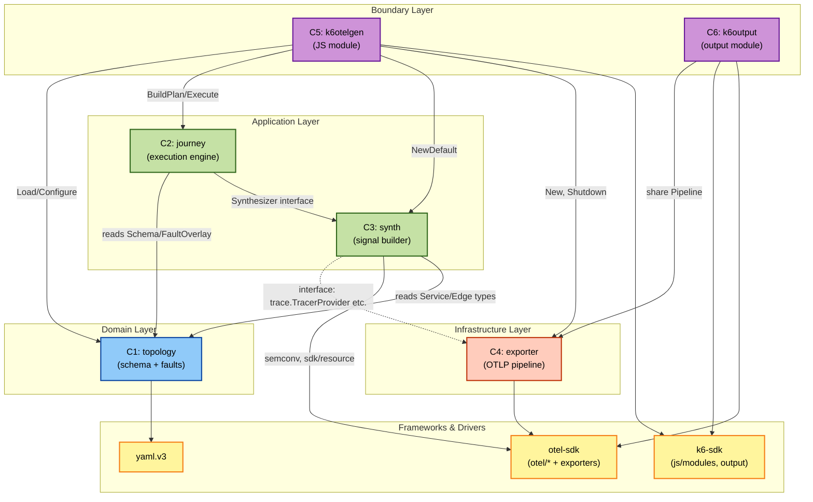

# Component Dependencies — xk6-otel-gen

> **パッケージレイアウト方針**: 全パッケージをトップレベル公開 (`internal/` も `pkg/` も使わない)。本書のレイヤ階層 (Boundary / Application / Domain / Infrastructure) は **設計上の概念区分** であり、Go の `internal/` 機構による物理的な強制ではありません。レイヤ越境の防止はレビューと依存マトリクスのチェックで担保します。

## 依存マトリクス

行が「依存する側」、列が「依存される側」。`✓` は import 依存、`(*)` は注釈、空白は依存なし。

| from \ to | C1 topology | C2 journey | C3 synth | C4 exporter | C5 k6otelgen | C6 k6output | otel-sdk | k6-sdk | yaml |
|---|---|---|---|---|---|---|---|---|---|
| **C1 topology** | — | | | | | | | | ✓ |
| **C2 journey** | ✓ | — | ✓ (interface) | | | | (std time/context) | | |
| **C3 synth** | ✓ (types) | | — | (*) Provider | | | ✓ | | |
| **C4 exporter** | | | | — | | | ✓ | | |
| **C5 k6otelgen** | ✓ | ✓ | ✓ | ✓ | — | (*) share | | ✓ | |
| **C6 k6output** | | | | ✓ (share) | (*) share | — | ✓ | ✓ | |
| **examples/** | (runtime) | | | | (built-in) | (built-in) | | | (runtime) |

(*) **Provider 共有**: C3 (synth) は **Pipeline インスタンスへの import 依存はしない**。代わりに `trace.TracerProvider` / `metric.MeterProvider` / `log.LoggerProvider` の **interface 注入** を受ける。これにより synth は exporter に直接依存しない。
(*) **Share**: C5 と C6 は同じ `*exporter.Pipeline` を参照する (singleton)。両者の協調は process-level の "registry" によって行う (`registry` のような薄い singleton holder、または `k6otelgen` 内で公開された `GetSharedPipeline()` を C6 が呼ぶ)。

---

## レイヤ階層 (Clean Architecture 風)

```
+--------------------------------------------------+
| Boundary Layer                                   |
|   k6otelgen (C5) ←→ k6output (C6)        |   k6 とのインターフェース
|                                                  |
|   share: registry / shared singleton             |
+--------------------------------------------------+
| Application Layer                                |
|   journey (C2)                          |   ユースケース実行
|   synth (C3)                            |   信号合成 (interface 経由)
+--------------------------------------------------+
| Domain Layer                                     |
|   topology (C1)                         |   ドメインモデル
+--------------------------------------------------+
| Infrastructure Layer                             |
|   exporter (C4)                         |   OTel SDK ラップ / OTLP I/O
+--------------------------------------------------+
| Frameworks & Drivers                             |
|   go.opentelemetry.io/otel/* (otel-sdk)          |
|   go.k6.io/k6/* (k6-sdk)                         |
|   gopkg.in/yaml.v3                               |
+--------------------------------------------------+
```

依存の方向: 上層から下層 / 同層内 (Boundary)。下層から上層への依存は禁止。
- C5/C6 (Boundary) は C2/C3 (Application)、C4 (Infrastructure) に依存可。
- C2/C3 (Application) は C1 (Domain) に依存可。C4 には直接 import しない (interface 経由)。
- C1 (Domain) はどこにも依存しない (外部は `yaml.v3` のみ)。
- C4 (Infrastructure) は OTel SDK のみに依存。Domain/Application/Boundary には依存しない。

---

## 依存図 (Mermaid)



凡例: 実線=直接 import 依存、点線=interface 経由 (synth は exporter を import せず、Provider interface を受け取る)。

---

## 通信パターン

### Pattern P1: 同期メソッド呼び出し (in-process)
- すべてのコンポーネント間通信は同一プロセス内の Go 関数呼び出し
- リモート通信は唯一 C4 → 外部 OTLP endpoint のみ

### Pattern P2: Interface 注入 (dependency inversion)
- C3 (synth) は C4 (exporter) の具象型を import しない
- 代わりに `trace.TracerProvider`, `metric.MeterProvider`, `log.LoggerProvider` interface を受け取る
- これにより C3 のテストでは mock Provider を注入可能 (PBT 容易化)

### Pattern P3: Singleton via sync.Once
- C1 (Schema)、C4 (Pipeline) はプロセスシングルトン
- C5 内の `sync.Once` で初期化、他の VU からは読み取り専用アクセス

### Pattern P4: per-VU 独立状態
- C2 (Engine) と C3 (Synthesizer の具象実装) は per-VU
- 各 VU の goroutine が独自インスタンスを保持 (Mutex 不要)

### Pattern P5: SDK BatchProcessor 経由の非同期 export
- C3 が `Tracer.Start/End` 等を呼んだ時点で同期処理は完了 (in-memory buffer 投入)
- 実際の OTLP 送信は SDK の BatchSpanProcessor などが goroutine で非同期実行
- C5/C6 から見たレイテンシは buffer 投入時間のみ

---

## サイクル / 抽象境界違反のチェック

| ありえそうな依存 | 状態 | 対策 |
|---|---|---|
| C1 → C2 (Domain が Application を知る) | 禁止 | C1 は Schema 型と最低限の Validate のみ。実行ロジックは C2 |
| C3 → C4 直接 import | 禁止 | interface 注入 (P2) |
| C4 → C1 | 不要 | exporter は Resource を引数で受け取る |
| C1 ↔ C4 | サイクル | 発生しない (両方 leaf) |
| C5 ↔ C6 | 同層 (許容) | shared registry / singleton holder で協調。public API は最小化 |

---

## 外部依存サマリ

| 外部モジュール | 用途 | 利用者 |
|---|---|---|
| `go.opentelemetry.io/otel/{trace,metric,log}` | Provider/Tracer/Meter/Logger interface | C3, C4 |
| `go.opentelemetry.io/otel/sdk/{trace,metric,log,resource}` | SDK 実装 (BatchProcessor 等) | C4, C3 (Resource) |
| `go.opentelemetry.io/otel/exporters/otlp/...` | OTLP/gRPC, OTLP/HTTP exporters | C4 |
| `go.opentelemetry.io/otel/semconv/v1.x.0` | Semantic Convention 定数 | C3 (attributes) |
| `gopkg.in/yaml.v3` | YAML パーサ | C1 |
| `go.k6.io/k6/js/modules` | k6 JS Module SDK | C5 |
| `go.k6.io/k6/output`, `go.k6.io/k6/metrics` | k6 Output SDK | C6 |
| `pgregory.net/rapid` (test only) | Property-Based Testing | 各テストファイル |

---

## "shared singleton" 実装方針 (要 Functional Design で確定)

C5 (JS Module) と C6 (Output Module) は同一の Exporter Pipeline を共有する必要がある。候補:

- **候補 A**: `registry` という極小パッケージを設け、`Set/Get` だけを公開 (`sync.Once` で初期化保証)。C5/C6 双方からアクセス。**推奨**: シンプル、テストもしやすい。
- **候補 B**: `k6otelgen` に `GetSharedPipeline()` を公開し、C6 が `k6otelgen` を import する。Layer的に C6 → C5 への依存になるため、C5 と C6 の対称性が崩れる。**非推奨**。
- **候補 C**: グローバル変数 (`var sharedPipeline *exporter.Pipeline`) を `exporter` 内に持つ。クリーンだがテストでの差し替えがやや複雑。

最終決定は NFR Design ステージで確定。
