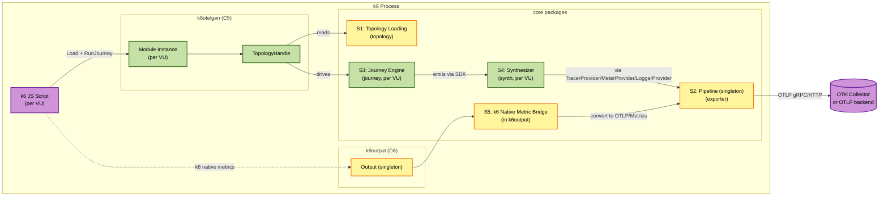

# Services & Orchestration — xk6-otel-gen

本書ではプロセス内の **サービスレイヤ** (orchestration/coordination の単位) と、k6 起動から OTLP 送信までのデータフローを整理します。Microservices としての "Service" ではなく、Go プロセス内の論理的な責任境界を指します。

---

## サービス一覧

| サービス | 実装場所 | スコープ | 起動タイミング |
|---|---|---|---|
| S1: Topology Loading Service | `topology` (singleton state in `k6otelgen`) | プロセスシングルトン | 初回 `Load(path)` 呼び出し時 |
| S2: Export Pipeline Service | `exporter.Pipeline` (singleton in `k6otelgen` / `k6output`) | プロセスシングルトン | 初回 `Configure` または k6 Output の `Start()` 時 |
| S3: Journey Execution Service | `journey.Engine` | per-VU | VU init 時 |
| S4: Synthesis Service | `synth.Synthesizer` (default impl) | per-VU (Provider 参照は共有) | VU init 時 |
| S5: k6 Native Metric Bridge Service | `k6output.Output` | プロセスシングルトン | k6 起動 (`--out otel-gen=...`) 時 |

---

## オーケストレーションフロー (End-to-End)

### Phase 0 — k6 拡張バイナリ起動
1. `k6 run --out otel-gen=endpoint=https://collector:4317 script.js`
2. k6 はモジュール `k6/x/otel-gen` を VU 数だけ初期化し、Output `otel-gen` を 1 つ初期化する。
3. **S5 (k6 Native Metric Bridge)** が `Start()` を呼ばれ、`exporter.ConfigFromEnv()` + `--out` の key=value を読み込んで **S2 (Pipeline)** を構築 (singleton)。

### Phase 1 — k6 スクリプト評価 (Setup)
4. JS スクリプトが `import otelgen from 'k6/x/otel-gen'` し、`otelgen.configure({...})` で追加設定を JS から差し込む。
5. `otelgen.load('topology.yaml')` 呼び出し → **S1 (Topology Loading)** が初回ロード (singleton)。`topology.Parse` 内部で **2 パス処理**:
   - Pass 1: YAML を非公開 `rawSchema` にデコード (string 参照のまま)
   - Pass 2: `*Service` を生成し `Schema.Services` マップに登録、すべての string 参照を `*Service`/`*Edge` ポインタに解決 (未解決参照は行番号付きエラーで失敗)
   - その後 `Validate` (DAG 性・到達可能性) と `ApplyFaults` (lookup 用 FaultOverlay 構築) を実行
6. **S2 (Pipeline)** がまだ構築されていなければ、`exporter.Config` を Q9=A の優先順位 (JS configure > env > YAML defaults > built-in) でマージし、`exporter.New(cfg)` を呼んで Provider 群を構築。
7. JS スクリプトに `TopologyHandle` が返る。

### Phase 2 — k6 シナリオ実行 (per-VU per-iteration)
8. 各 VU iteration は `topology.runJourney('checkout')` を呼ぶ。
9. **S3 (Journey Execution)** が `Engine.BuildPlan('checkout')` で Plan を構築 (キャッシュ可)。Plan は journey の `Steps` から始まり、各 step の entry `Operation` を起点に **Operation tree** (`Operation.Calls` を再帰的に辿った木) を Plan 木に展開する。
10. `Engine.Execute(ctx, plan)` が起動:
    - **Operation の実行**: journey step が `Op` を指すと、まずそのサービスで Op 自身の span を開始 (caller-side span)。続いて `Op.Calls` を順次処理する (`CallNode` ごと)。`Calls` のすべてが完了したら Op の span を close。
    - **CallNode の処理** (sequential by default):
      - `CallNode.Parallel != nil` のとき: `sync.WaitGroup` で子 CallNode を並行実行 → join
      - `CallNode.Edge != nil` のとき: 単一エッジを呼ぶ (下記の手順)
    - **エッジ呼び出し** (リカバリーフロー対応):
      1. **プライマリ呼び出し** — Failure Overlay を参照し、エッジの `ErrorRate` と組み合わせて確率的に成否を決定。成功時は target `Operation` を再帰実行 (= callee 側の span を開始してその `Calls` を辿る)。
      2. **失敗時のリカバリー試行** — エッジに `OnFailure` が定義されていれば、`Fallback` チェーンを順に試行。各 fallback も独立した子 span を発行 (失敗・成功とも全部 trace に残る)。最初に成功した fallback で確定 → その fallback の target Operation を再帰実行。
      3. **すべての fallback も失敗 → `OnExhausted` を評価**:
         - `propagate`: ステップを失敗扱いとし、**親 Operation 全体を失敗とマークして下流呼び出しを `upstream_unavailable` Outcome に切り替える**。
         - `return_default`: ステップを成功扱い、`DefaultResponse` を attribute として span/log に記録 (`fallback.default_used=true`)。target Operation の再帰は **スキップ** (デフォルト応答が直接返ったため)。
         - `succeed_silently`: ステップを成功扱い、追加 attribute なし。target Operation 再帰はスキップ。
      4. **`OnFailure` が未定義のときに失敗 → 即時カスケード** (親 Operation 失敗、下流呼び出しを `upstream_unavailable` 化)。
      5. 確定 Outcome について **S4 (Synthesis)** の `BeginSpan` → `RecordMetric` → `EmitLog` を呼ぶ (リカバリー使用時は `fallback.used=<edge-id>`, `fallback.primary_failed=true` 等の属性を付与)。
    - 各 edge のレイテンシ分だけ `time.Sleep` (Q6=A 実時間モデル)。リカバリー試行が走った場合は **primary timeout/latency + fallback latency の合計** が消費される。
    - journey step 自体に `Parallel: []*Step` が設定されていれば journey step レベルでも並列起動 (稀)。
11. すべての step / operation tree 完了後、`Engine.Execute` がリターン。

YAML スキーマの全体像と完全例は [`topology-yaml-schema.md`](./topology-yaml-schema.md) を参照。

### Phase 3 — 信号 export (非同期)
12. S4 が SDK の Tracer/Meter/Logger を介して投入した span/metric/log は、SDK の BatchProcessor がバッファし、設定された batch size / timeout に従って **S2 (Pipeline)** の Exporter に flush。
13. Exporter は OTLP/gRPC または OTLP/HTTP で OTel Collector / バックエンドに送信。失敗は retry。

### Phase 4 — k6 ネイティブメトリクスの並行送信
14. k6 ランタイムは VU の様々な内部メトリクス (vus, iterations, http_req_*, checks など) を発行し、**S5 (k6 Native Metric Bridge)** の `AddMetricSamples` に流す。
15. S5 は受信した `metrics.Sample` を OTLP/Metrics 用 attribute に変換し、**同一の S2 Pipeline** に投入 (異なる `service.name="xk6-otel-gen-runner"` で区別)。

### Phase 5 — Shutdown
16. k6 シナリオ終了時、k6 が Output `Stop()` を呼ぶ。S5 が S2 Pipeline の `Shutdown(ctx)` を呼び、pending batch を flush。
17. **End-of-run Summary は k6 標準機構が独立に処理** (本拡張は介在しない):
    - デフォルト: stdout にサマリ出力
    - `--summary-export=summary.json`: JSON ファイル書き出し
    - JS スクリプトに `handleSummary(data)` 定義: 任意のフォーマット/任意ファイル
    Summary は k6 内部で `Output.AddMetricSamples` とは別の経路で生成されるため、本拡張の Output モジュールには渡されない。よって「実行中メトリクスは OTLP、完了レポートは stdout/ファイル」が追加設定なしで成立する。
18. プロセス終了。

---

## データフロー図



凡例:
- 紫: 境界 (JS スクリプト / 外部 backend)
- 緑: per-VU インスタンス
- 黄: プロセスシングルトン

---

## 主要なオーケストレーション契約

### 契約 O-1: シングルトン共有
- **S1 (Schema)** と **S2 (Pipeline)** はプロセス内で 1 つだけ。複数 VU から同時に参照されるため、Schema は読み取り専用、Pipeline は内部で thread-safe であること。
- 初期化は `sync.Once` 等で one-shot。VU init 中の競合は許容するが二重ロードしない。

### 契約 O-2: Resource 属性の per-Service 分離
- 同一プロセスで複数の `service.name` を持つテレメトリを送出する必要がある (各仮想サービスごとに異なる Resource、加えて k6 ネイティブメトリクス用に `xk6-otel-gen-runner`)。
- OTel SDK の TracerProvider は 1 つでよいが、Tracer の取得時に Resource を区別できる仕組みが必要。実装方針は Functional Design / NFR Design で確定 (候補: per-service `TracerProvider` を内部マップ管理 / Span attribute で resource をエミュレート / 各サービス用 `Tracer` を resource scope 単位で取得)。

### 契約 O-3: 設定優先順位 (Q9=A)
```
JS .configure(opts) > 環境変数 (OTEL_EXPORTER_OTLP_*) > YAML defaults > built-in defaults
```
- S2 (Pipeline) の `Config.MergeWith` がこの順序を実装。
- 一度 Pipeline が構築されたあとの再設定はサポートしない (k6 ライフサイクル的に必要性が低い)。

### 契約 O-4: 失敗注入と条件付きカスケード (改訂)
- S1 の `ApplyFaults` は overlay を「lookup 可能な辞書」として構築する (node 名 → fault, edge 識別子 → fault)。
- S3 (Engine) は実行時に **エッジごと** の lookup で Outcome を決定する。
- **カスケードは事前計算しない** — エッジ呼び出しの最終的な結果 (リカバリーチェーン込み) によって決まる:
  - エッジに `OnFailure.Fallback` が定義され、いずれかが成功 → ステップは成功 → **カスケードは発生しない** (リアルな cache-aside / circuit-breaker fallback の振る舞い)
  - `OnFailure` 未定義、または fallback もすべて失敗かつ `OnExhausted=propagate` → **下流に `upstream_unavailable` を伝播**
  - `OnExhausted=return_default` / `succeed_silently` → ステップ成功 → カスケードしない
- これにより「データベースが落ちていてもキャッシュで対応可能なら障害にならない」という宣言的モデリングが可能になる。

### 契約 O-5: per-VU 分離
- S3 (Engine) と S4 (Synthesizer) のインスタンスは per-VU。これにより、各 VU の goroutine 内で sync.Mutex を使わずに状態を保持できる。
- 共有が必要な状態 (Schema, FaultOverlay, Pipeline) は読み取り専用または内部 thread-safe。

### 契約 O-7: リカバリーフロー実行とトラフィック挙動 (NEW)
- リカバリーフロー (`Edge.OnFailure.Fallback`) は **エッジ呼び出し失敗時のみ発火** する。
- 正常時、fallback エッジへの RPS は **0** (このジャーニーパス経由では呼ばれない)。
- プライマリ失敗時、そのエッジに来るはずだったトラフィックが **fallback チェーンに転送される** ため、fallback 先のメトリクスが急増する (現実の cache-aside パターンと同じ観測)。
- 各 fallback 呼び出しは独立した子 span を持ち、`fallback.role=fallback`, `fallback.primary={edge-id}`, `fallback.attempt={N}` 等の属性で識別可能。
- リカバリー使用率は **拡張自身の内部メトリクス** にも反映: `xk6_otel_gen.recovery.invoked.total{edge=...,outcome=...}` (詳細は NFR Design)。

### 契約 O-6: Graceful Shutdown
- k6 が Output の `Stop()` を呼んだとき、S5 経由で S2 の `Shutdown(ctx)` を呼ぶ。これにより BatchProcessor の pending batch が flush され、終了前に欠損なく送信される。
- k6 Output が `--out otel-gen` で起動されていない場合のフォールバック: JS Module instance の `Cleanup` フックで Pipeline.Shutdown を呼ぶ (k6 が提供する VU teardown hook を利用)。

---

## エラーパス / リカバリ

| 失敗源 | 検知箇所 | 振る舞い |
|---|---|---|
| YAML パースエラー / バリデーションエラー | S1 (Topology Loading) | k6 init 時に panic 相当 (JS から throw)、k6 ラン全体を停止 (fail fast) |
| 未定義ジャーニー名で `runJourney` 呼び出し | S3 (Journey Engine) | iteration 単位の error (k6 はそれ単独で fail カウント、ランは継続) |
| OTLP 接続失敗 | S2 (Pipeline) の Exporter | SDK の retry policy に従ってリトライ。失敗カウントは Stats に記録、k6 ログに warning |
| Pipeline 内部キュー overflow | S2 (Pipeline) | drop-with-count (NFR-1.4)、Stats に記録 |
| `time.Sleep` 中の context cancel (k6 abort) | S3 (Engine) | iteration を中断し、開始済み span は `status=error, error.type="aborted"` で finish |
