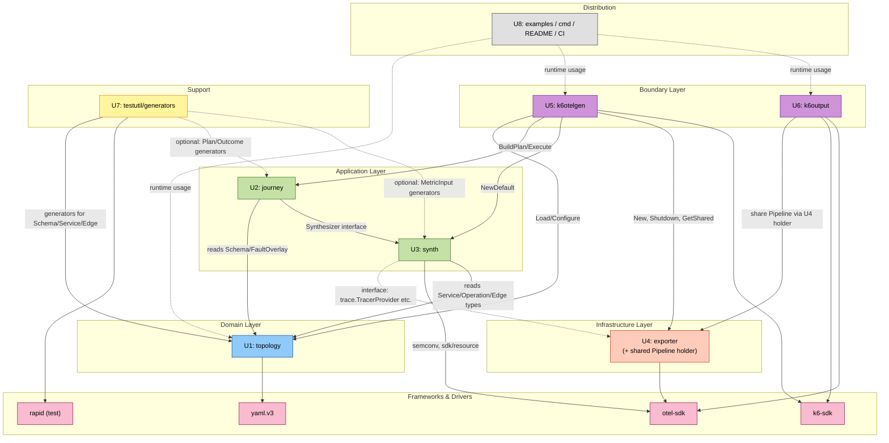

# Unit of Work Dependency — xk6-otel-gen

本書はユニット間の依存関係と Construction フェーズの推奨進行順を定めます。

---

## 依存マトリクス (build-time import 依存)

行が「依存する側」、列が「依存される側」。`✓` は import 依存、`(*)` は注釈、空白は依存なし。

| from \ to | U1 topology | U2 journey | U3 synth | U4 exporter | U5 k6otelgen | U6 k6output | U7 testutil | U8 dist |
|---|---|---|---|---|---|---|---|---|
| **U1 topology** | — | | | | | | | |
| **U2 journey** | ✓ | — | ✓ (interface) | | | | | |
| **U3 synth** | ✓ (types) | | — | (*) Provider | | | | |
| **U4 exporter** | | | | — | | | | |
| **U5 k6otelgen** | ✓ | ✓ | ✓ | ✓ | — | (*) share | | |
| **U6 k6output** | | | | ✓ (share) | (*) share | — | | |
| **U7 testutil** | ✓ | (✓) | (✓) | | | | — | |
| **U8 dist** | (runtime) | (runtime) | (runtime) | (runtime) | (built-in) | (built-in) | | — |
| **tests (per unit)** | ✓ | ✓ | ✓ | ✓ | ✓ | ✓ | ✓ (consumes) | |

(*) **Provider 共有**: U3 (synth) は **U4 (exporter) を import しない**。代わりに `trace.TracerProvider` / `metric.MeterProvider` / `log.LoggerProvider` の **interface 注入** を受ける (Application Design Pattern P2)。

(*) **Pipeline 共有 (U5↔U6)**: U5 と U6 は同じ `*exporter.Pipeline` を参照する (singleton)。共有は U4 内の registry/holder API を介する (Q5=A、U5/U6 双方が U4 を import)。

(✓) **U7 の依存範囲**: U7 (testutil/generators) は U1 の型を直接 import してジェネレータを定義する。U2/U3 の型 (Plan, Outcome, MetricInput 等) はジェネレータが必要な範囲で追加 import する (Functional Design で確定)。

---

## レイヤ階層 (Clean Architecture 風)

```text
+----------------------------------------------------+
| Boundary Layer                                     |
|   U5 k6otelgen ←─[share via U4]─→ U6 k6output      |
+----------------------------------------------------+
| Application Layer                                  |
|   U2 journey  +  U3 synth                          |
+----------------------------------------------------+
| Domain Layer                                       |
|   U1 topology                                      |
+----------------------------------------------------+
| Infrastructure Layer                               |
|   U4 exporter (+ shared Pipeline holder)           |
+----------------------------------------------------+
| Support (cross-cutting)                            |
|   U7 testutil/generators                           |
+----------------------------------------------------+
| Distribution                                       |
|   U8 examples / cmd / README / CI                  |
+----------------------------------------------------+
| Frameworks & Drivers                               |
|   go.opentelemetry.io/otel/*,  go.k6.io/k6/*,  yaml.v3,  pgregory.net/rapid (test) |
+----------------------------------------------------+
```

依存方向: 上層 → 下層 / 同層内 (Boundary)。下層 → 上層は禁止。

---

## 依存図 (Mermaid)



凡例:
- 実線 = 直接 import 依存
- 点線 = interface 経由 (U3 は U4 を import しない) / オプショナル依存 (U7 の Plan/Outcome 用ジェネレータ) / runtime 利用 (U8)

---

## 推奨ビルド順序 (Q2=A 依存ボトムアップ + Q3=A 完全逐次)

```text
┌────────────────────────────────────────────────────────────────────────┐
│  U7 (testutil 骨格)                                                    │
│    ↓                                                                   │
│  U1 (topology)              ← Domain leaf。最初に建つ                  │
│    ↓                                                                   │
│  U4 (exporter)              ← Infrastructure leaf。OTel SDK ラップ     │
│    ↓                                                                   │
│  U3 (synth)                 ← Provider interface を U4 から受け取り    │
│    ↓                                                                   │
│  U2 (journey)               ← U1 + U3 (interface) を組合せ実行         │
│    ↓                                                                   │
│  U5 (k6otelgen)             ← 全 internal を統合し JS module 化        │
│    ↓                                                                   │
│  U6 (k6output)              ← U4 holder を経由して Pipeline 共有       │
│    ↓                                                                   │
│  U8 (examples / dist)       ← 最終: サンプル, README, JSON Schema      │
└────────────────────────────────────────────────────────────────────────┘
   その後 → Build and Test ステージ (CI / release / integration test)
```

### なぜこの順番か

| ステップ | 理由 |
|---|---|
| U7 を最初 | U1 の Functional Design で識別される "Testable Properties" を即座に PBT 化できるよう、骨格 (パッケージ・空のジェネレータ) を先に作る。U7 自体の中身は U1 と並走で拡張 |
| U1 を 2 番目 | 全ユニットの **型の供給元**。これが固まらないと U2/U3/U5/U7 が型 import できない |
| U4 を 3 番目 | U3 が依存する Provider interface の **具象実装** は OTel SDK が用意するが、Pipeline 構築コードと shared holder を先に作っておくと U3 のテストで実 Pipeline を使える |
| U3 を 4 番目 | U2 から呼ばれる Synthesizer interface の **default 実装** を提供。interface 自体は U3 内で定義 |
| U2 を 5 番目 | U1 + U3 を組み合わせて Plan を構築・実行できるレベルに到達。ここまで来ると **k6 抜きで動作確認可能** な状態 |
| U5 を 6 番目 | 全 internal を統合し、k6 JS 経由で起動できる最初のバージョン |
| U6 を 7 番目 | U4 の shared holder API が安定しているため、ここで k6 ネイティブメトリクスの OTLP ブリッジを実装 |
| U8 を最後 | サンプル/README/CI は最終形が固まってから整える |

### U7 だけ「並走」する点について

Q3=A (完全逐次) を尊重しつつ、U7 は **U1〜U6 の各 Functional Design で生まれる "Testable Properties" の集合に追従して育つ**。各ユニットの Code Generation を完了するための前提条件 (PBT-01 が要求するプロパティ識別) を満たすため、各ユニットの FD 段階で U7 への追加項目をプランに織り込むことで、レビュー単位の clarity は維持される。

---

## サイクル / 抽象境界違反の検査

| ありえそうな依存 | 状態 | 対策 |
|---|---|---|
| U1 → U2 (Domain が Application を知る) | 禁止 | U1 は Schema 型と Validate のみ。実行ロジックは U2 |
| U3 → U4 直接 import | 禁止 | interface 注入 (Pattern P2) |
| U4 → U1 | 不要 | exporter は Resource を引数で受け取る |
| U5 ↔ U6 直接 import | 禁止 | U4 内の shared holder API を介する |
| U7 → U2/U3/U4 | 限定的に許容 | ジェネレータが必要とする型のみ。実装ロジックは持たない |
| U8 → U1〜U6 (runtime) | 許容 | サンプル/CLI が公開 API を利用 |

サイクル検査ツール: `go-cyclic` または `revive`/`golangci-lint` の `cyclic` リンタを CI で有効化 (Build and Test ステージで設定確定)。
