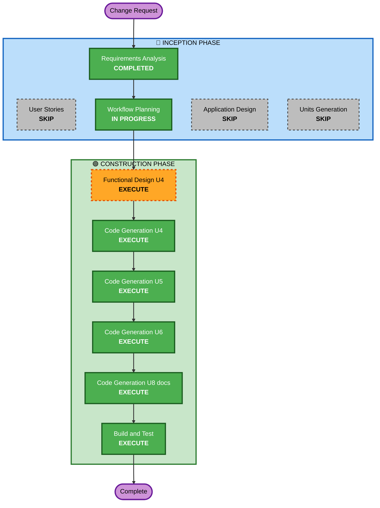

# Execution Plan — Per-Signal Endpoint Support

**Change Request**: ベースエンドポイント(OTLP 仕様パス補完)+ シグナル別エンドポイントの 2 パターン対応
**Requirements**: `aidlc-docs/inception/requirements/endpoint-config-requirements.md`
**Date**: 2026-06-12

## Detailed Analysis Summary

### Transformation Scope
- **Transformation Type**: Single-concern enhancement across existing units(アーキテクチャ変更なし)
- **Primary Changes**: `exporter.Config` のエンドポイント解決ロジック(OTLP 仕様準拠のパス補完 + per-signal override)
- **Related Components**: U4 `exporter/`(中核)、U5 `k6otelgen/`(JS キー)、U6 `k6output/`(--out キー)、U8 `examples/`+README(ドキュメント)

### Change Impact Assessment
- **User-facing changes**: Yes — 新設定キー(`tracesEndpoint`/`metricsEndpoint`/`logsEndpoint`)と、URL 形式ベース `endpoint` の挙動変更(破壊的、ドキュメント告知)
- **Structural changes**: No — 既存ユニット境界内の変更
- **Data model changes**: Yes(軽微)— `exporter.Config` / `k6output.Params` へのフィールド追加
- **API changes**: Yes(追加的)— JS config キー、--out args キー、環境変数の per-signal 適用修正
- **NFR impact**: Yes — OTLP 仕様準拠(正確性)、PBT によるパス補完検証、解決後エンドポイントのログ出力

### Component Relationships
- **Primary Component**: `exporter/`(config.go / exporters.go / pipeline)
- **Dependent Components**: `k6otelgen/`(optsToConfig → exporter.Config)、`k6output/`(Params → exporter.Config)
- **Supporting Components**: `examples/`、README、doc.go(ドキュメント)

### Risk Assessment
- **Risk Level**: Low-Medium — 変更は端点解決に局所化。破壊的変更は URL 形式ベースエンドポイント利用者のみに影響(v0.x、告知あり)
- **Rollback Complexity**: Easy(コミット単位で revert 可能)
- **Testing Complexity**: Moderate(PBT + 3 サーフェスの優先順位マトリクス)

## Workflow Visualization

## Phases to Execute

### 🔵 INCEPTION PHASE
- [x] Requirements Analysis (COMPLETED — endpoint-config-requirements.md, commit 46a38dd)
- [x] User Stories — SKIP
  - **Rationale**: 単一ステークホルダーの設定機能。要件と検証質問で受け入れ条件は確定済み
- [x] Workflow Planning (IN PROGRESS — this document)
- [ ] Application Design — SKIP
  - **Rationale**: 新コンポーネントなし。既存ユニット境界内の変更(Config 拡張 + 解決ロジック)
- [ ] Units Generation — SKIP
  - **Rationale**: 既存ユニットインベントリ(U4/U5/U6/U8)をそのまま使用。新ユニット不要

### 🟢 CONSTRUCTION PHASE
- [ ] Functional Design (U4 exporter のみ) — EXECUTE
  - **Rationale**: OTLP 仕様のパス構築規則・優先順位解決は仕様準拠が要求される新規ビジネスロジック。
    テスト可能なプロパティ(PBT 拡張 Full)をここで定義する。U5/U6 は単純なキー追加のため FD 不要
- [ ] NFR Requirements — SKIP
  - **Rationale**: 技術スタック確定済み。NFR は requirements の NFR-1〜4 で捕捉済みで新規 NFR なし
- [ ] NFR Design — SKIP
  - **Rationale**: NFR Requirements をスキップするため(既存パイプライン構造に変更なし)
- [ ] Infrastructure Design — SKIP
  - **Rationale**: インフラ変更なし(バイナリ配布のライブラリ)
- [ ] Code Generation — EXECUTE (U4 → U5 → U6 → U8 の順で逐次)
  - **Rationale**: 実装は必須。依存順(中核ロジック → 利用側 → ドキュメント)
- [ ] Build and Test — EXECUTE
  - **Rationale**: go build / go test 全件 + xk6 ビルドでの実機確認(Grafana Cloud 形式エンドポイント)

### 🟡 OPERATIONS PHASE
- [ ] Operations — PLACEHOLDER

## Module Update Strategy
- **Update Approach**: Sequential(U4 → U5 → U6 → U8)
- **Critical Path**: U4 `exporter/` — Config フィールドと解決ロジックが U5/U6 の前提
- **Coordination Points**: `exporter.Config` の新フィールド名(U5 optsToConfig / U6 Params.exporterConfig が参照)
- **Testing Checkpoints**: U4 完了時(ユニット + PBT)、U6 完了時(統合)、Build and Test(全体 + 実機)

## Estimated Timeline
- **Total Stages**: 4(FD U4、Code Generation ×4 ユニット、Build and Test ※Code Generation は 1 ステージ内で 4 ユニット逐次)
- **Estimated Duration**: 1 セッション

## Success Criteria
- **Primary Goal**: Grafana Cloud OTLP ゲートウェイ(ベース `/otlp`)へ 3 シグナルとも 404 なしで送信できる
- **Key Deliverables**:
  - OTLP 仕様準拠のエンドポイント解決(`v1/{signal}` 補完 + per-signal as-is override)
  - 3 設定サーフェス(JS / --out / env)すべてで両パターンが機能
  - PBT を含むテスト、更新されたドキュメント・サンプル
- **Quality Gates**:
  - `go build ./...` / `go test ./...` 全件成功
  - PBT プロパティ(補完結果が `/v1/{signal}` 終端、ベース保持、1 回のみ追記、優先順位)成立
  - 破壊的変更の README / CHANGELOG 告知
