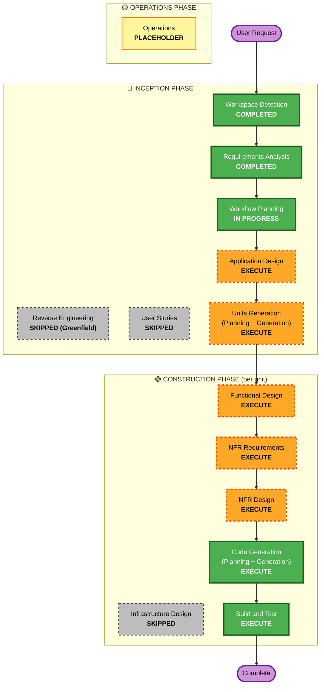

# Execution Plan — xk6-otel-gen

## Multi-Agent Workflow — Role Boundaries

本リポジトリは AI-DLC ワークフローを **3 種のエージェント** で分担実行します。詳細契約はリポジトリルートの `AGENTS.md` を参照してください。

| Agent | 担当ステージ | 出力対象 |
|---|---|---|
| **Claude Code** | Workspace Detection 〜 Code Generation の **Planning** まで (全設計ドキュメント) | `aidlc-docs/**` |
| **OpenAI Codex CLI** (gpt-5.5 xhigh) | Code Generation の **Generation 部分** (自律的バッチ実装) + Build and Test の自動化スクリプト生成 | Go ソースツリー全般 (`cmd/`, `internal/`, `pkg/`, `examples/`, `test/`) |
| **Cursor Composer 2.5** | Codex 出力の対話的修正・レビュー反映・デバッグ・リファクタリング | Go ソースツリー全般 (差分単位) |

**重要**: Code Generation ステージは2部構成 (Planning / Generation)。Claude が `code-generation-plan.md` を生成・承認まで担当し、その後ユーザーが Codex CLI / Cursor を起動して `code-generation-plan.md` のチェックボックスを 1 つずつ実装していく流れ。

### 設定ファイル

- `AGENTS.md` (リポジトリルート) — Codex CLI / 全エージェント共通契約
- `.codex/config.toml` — Codex CLI のモデル選択 (gpt-5.5 high) と sandbox 設定
- `.cursor/rules/00-project-handoff.mdc` — Cursor の役割と境界 (常時適用)
- `.cursor/rules/10-go-conventions.mdc` — Go コード規約 (`*.go` 編集時)
- `.cursor/rules/20-pbt-enforcement.mdc` — PBT 強制ルール (テストファイル編集時)
- `.cursor/rules/30-otel-semantic-conventions.mdc` — Semantic Conventions (synth/exporter 編集時)

---

## Detailed Analysis Summary

### Change Impact Assessment

| Impact Area | Yes/No | Description |
|---|---|---|
| User-facing changes | Yes | k6 ユーザー向けの新規 JS API (`k6/x/otel-gen`) と新規出力モジュール |
| Structural changes | Yes (new) | 新規プロジェクトのため、構造そのものを設計 |
| Data model changes | Yes (new) | YAML スキーマ・トポロジーグラフ・OTLP ペイロード合成モデル |
| API changes | Yes (new) | JS API (declarative `runJourney`)、k6 出力モジュール CLI フラグ |
| NFR impact | Yes | 1k RPS の性能目標、PBT Full enforcement、OTLP 双方向プロトコル |
| Infrastructure | **No** | バイナリ配布のみ。クラウドリソース/IaC は対象外 |

### Risk Assessment

- **Risk Level**: **Medium**
- **Rollback Complexity**: Easy — Greenfield のため git revert / バージョン pin で十分。本拡張は別バイナリで配布されるため、k6 本体や利用者環境への影響は最小。
- **Testing Complexity**: Moderate — Unit + Integration (Docker 上の OTel Collector に対する送信検証)、加えて PBT 全規則を主要ロジックに適用。
- **Main Uncertainties**:
  - xk6 拡張で「JS モジュール」と「出力モジュール」を同居させる前例の少なさ
  - OTel Semantic Conventions の進化への追従戦略
  - 1k RPS 時の OTLP バッチング/メモリプロファイル

### Tentative Unit Decomposition (will be refined in Units Generation)

1. **Topology Schema & Parser** — YAML スキーマ定義、パーサ、バリデータ、JSON Schema 出力
2. **Topology Model & Journey Engine** — DAG モデル、CUJ (Critical User Journey) の探索/実行プラン生成、障害伝播ルール
3. **Signal Synthesizer** — Traces / Metrics / Logs を Semantic Conventions に従って合成 (リソース属性、span 階層、メトリクス時系列、log レコード)
4. **OTLP Exporter Pipeline** — バッチング、gRPC + HTTP/protobuf、リトライ、内部キュー、自己メトリクス
5. **k6 Integration Layer** — JS モジュール (`k6/x/otel-gen`) + 出力モジュール (`--out otel-gen=...`)、JS API バインディング、k6 メトリクスへの自己観測値の橋渡し
6. **Samples & Distribution** — minimal/realistic サンプルトポロジー、サンプル k6 スクリプト、README、xk6 build 手順、CI、Apache-2.0 ライセンスファイル

---

## Workflow Visualization

---

## Phases to Execute

### 🔵 INCEPTION PHASE
- [x] **Workspace Detection** — COMPLETED
- [x] **Reverse Engineering** — SKIPPED
  - *Rationale*: Greenfield プロジェクト、既存コードなし
- [x] **Requirements Analysis** — COMPLETED
- [x] **User Stories** — SKIPPED
  - *Rationale*: 単一ステークホルダー (本人) の開発者向け OSS ライブラリ。要件と CUJ がすでに `requirements.md` に十分明確に表現されており、ペルソナ/受入基準を別文書化する付加価値が乏しい。後で必要になれば追加可能。
- [x] **Workflow Planning** — IN PROGRESS
- [ ] **Application Design** — **EXECUTE**
  - *Rationale*: 6 つの内部コンポーネント (パーサ、トポロジーモデル、シグナル合成、エクスポータ、k6 統合、サンプル) を新設するため、コンポーネント間の境界・責務・依存関係・I/F を事前に設計する必要がある。
- [ ] **Units Generation** — **EXECUTE**
  - *Rationale*: 上記コンポーネントを並行/順次設計・実装できる単位に分解する必要があり、Construction の per-unit loop の対象集合を確定する。

### 🟢 CONSTRUCTION PHASE (per-unit loop で各ユニットに適用)
- [ ] **Functional Design** — **EXECUTE** (per unit)
  - *Rationale*: 新規データモデル (YAML スキーマ、トポロジーグラフ、span/metric/log の合成ルール) と複雑な業務ロジック (障害伝播、レイテンシ分布、リトライ模擬) を持つ。**PBT-01 により Functional Design の "Testable Properties" セクションが必須**。
- [ ] **NFR Requirements** — **EXECUTE** (per unit)
  - *Rationale*: 1k RPS の性能目標、Go/xk6/OTel SDK のテックスタック選定、**PBT-09 の PBT フレームワーク選定** (`pgregory.net/rapid` 想定) を確定する必要がある。
- [ ] **NFR Design** — **EXECUTE** (per unit)
  - *Rationale*: バッチング、メモリ管理、内部キュー、自己観測メトリクス、Semantic Conventions マッピング層など、NFR を満たすための設計を反映する必要がある。
- [ ] **Infrastructure Design** — **SKIPPED**
  - *Rationale*: 本プロジェクトはバイナリ拡張の配布のみで、ホスト/クラウドリソース、ネットワーク、ストレージ、IaC を伴わない。利用者の OTel Collector や OTLP エンドポイントは外部前提。CI (GitHub Actions) 等の build/release インフラは Build and Test ステージで取り扱う。
- [ ] **Code Generation** — **EXECUTE** (per unit, ALWAYS)
  - *Rationale*: 実装は本プロジェクトの最終成果物そのもの。
  - **役割分担**: Planning 部 (= 詳細な `code-generation-plan.md` 作成) を **Claude** が実施。Generation 部 (= 実コード生成) は **Codex CLI** (自律バッチ) + **Cursor Composer** (対話的編集) が AGENTS.md と code-generation-plan.md に従って実行。
- [ ] **Build and Test** — **EXECUTE** (after all units)
  - *Rationale*: xk6 ビルド手順、Unit テスト、Integration テスト (Docker OTel Collector)、PBT を CI に組み込む。
  - **役割分担**: 設計・テスト戦略文書を **Claude**、CI YAML や Docker compose 等の実装ファイル生成を **Codex CLI** / **Cursor**。
  - **Deferred decisions to revisit here**:
    - リポジトリ初期化時に置かれたスキャフォルド設定ファイルの取捨選択 (Security Baseline をオプトアウトしたため一部は不要の可能性):
      - `.bandit` (Python 用、Go プロジェクトでは不要 → 削除候補)
      - `.checkov.yaml` (IaC 用、本プロジェクトに IaC 無し → 削除候補)
      - `.grype.yaml` (脆弱性スキャン、CI に組み込むなら保持)
      - `.gitleaks.toml` + `.gitleaks-baseline.json` (シークレット検出、OSS 公開時に有用 → 保持推奨)
      - `.semgrepignore` (Semgrep 不使用なら削除)
      - `.pre-commit-config.yaml` (内容と必要性を再評価)
      - `.markdownlint-cli2.yaml` (`aidlc-docs/` の lint に有用 → 保持)
    - CI システムの選定 (GitHub Actions 想定) と `.github/workflows/` の構成
    - リリース戦略 (タグ付け、SemVer、GoReleaser 等)

### 🟡 OPERATIONS PHASE
- [ ] **Operations** — PLACEHOLDER
  - *Rationale*: 現状の AI-DLC ワークフロー定義ではプレースホルダー。リリース運用 (GitHub Releases、Versioning) は Build and Test 段階で最低限カバーする。

---

## Per-Unit Decision Hints (preliminary)

| Tentative Unit | FD | NFR-R | NFR-D | Infra | CG |
|---|---|---|---|---|---|
| 1. Topology Schema & Parser | ✅ | ✅ | ✅ | ⏭ | ✅ |
| 2. Topology Model & Journey Engine | ✅ | ✅ | ✅ | ⏭ | ✅ |
| 3. Signal Synthesizer | ✅ | ✅ | ✅ | ⏭ | ✅ |
| 4. OTLP Exporter Pipeline | ✅ | ✅ | ✅ | ⏭ | ✅ |
| 5. k6 Integration Layer | ✅ | ✅ | ✅ | ⏭ | ✅ |
| 6. Samples & Distribution | (簡略) | (簡略) | (簡略) | ⏭ | ✅ |

(✅ = execute, ⏭ = skip。最終確定は Units Generation ステージにて)

---

## Estimated Timeline & Effort

- **Total stages to execute in Inception**: 2 (Application Design, Units Generation)
- **Total stages to execute in Construction**: 5 per unit (FD + NFR-R + NFR-D + CG planning + CG generation) × 6 units + Build and Test
- **Estimated total interaction stages**: 約 35 ゲート (各ステージで承認待ち)
- **Wall-clock effort**: 提案・レビューサイクル次第。フォーカスして実施すれば、Inception 残: 1〜2 セッション、Construction: 6〜10 セッションの目安。

---

## Success Criteria

- **Primary Goal**: トポロジー YAML を入力に、k6 ランから OTLP/gRPC・OTLP/HTTP の双方で Metrics/Logs/Traces を OTel Semantic Conventions の主要部分に準拠して送信できる k6 拡張バイナリを完成させる。
- **Key Deliverables**:
  - `xk6-otel-gen` リポジトリ (Apache-2.0)
  - YAML スキーマ + JSON Schema
  - JS モジュール + k6 出力モジュール
  - Minimal/Realistic サンプルトポロジー & k6 スクリプト
  - Unit + Integration テスト一式
  - PBT 全規則を主要ロジックに適用
  - README + 利用ガイド
- **Quality Gates**:
  - Integration テストが Docker OTel Collector に対して PASS
  - PBT 全規則 compliant (PBT-01〜PBT-10 のうち本プロジェクトに該当するもの)
  - 1k RPS 持続を性能テストで確認 (best-effort, NFR-1.1)
  - `xk6 build` で再現可能なバイナリビルドが成功
